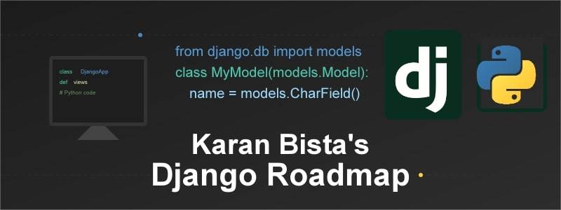

# Django-Roadmap



# 📘 Django Roadmap

Welcome to my **Django Roadmap** repository! 🌟 This repo outlines my structured learning path for mastering Django, one of the most popular web development frameworks. It includes my goals, weekly progress, and hands-on projects. This roadmap will help me track my development journey and serve as a guide for others looking to follow a similar path.The projects are the part of my learning from Maximilian Schwarzmüller's Python Django - The Practical Guide which is available on udemy, However I have made sure to add some modifications to the projects.

---

## 💡 **Why This Roadmap?**

This repository was created to provide a clear and organized plan for learning Django. By following this roadmap, I aim to become proficient in developing full-stack web applications and solidify my knowledge of back-end development concepts.

---

## 📚 **Table of Contents**

- [Learning Goals](#-learning-goals)
- [Weekly Plan](#-weekly-plan)
- [Projects](#-projects)
- [Technologies Used](#-technologies-used)
- [How to Use](#-how-to-use)
- [Contributing](#-contributing)
- [Contact](#-contact)

---

## 🌟 **Learning Goals**

- ✅ Understand Django’s core concepts (Models, Views, Templates, URLs)
- ✅ Learn to use Django’s ORM (Object-Relational Mapping) to interact with databases
- ✅ Master Django’s admin panel for easy content management
- ✅ Implement user authentication, authorization, and session management
- ✅ Create real-world projects to apply learning (To-Do App, Blog, E-Commerce site)
- ✅ Improve skills in front-end technologies (HTML, CSS, JavaScript) to complement Django
- ✅ Learn to deploy Django projects on live servers (Heroku, AWS, etc.)

---

## 🔄 **Weekly Plan**

| **Week** | **Topics & Concepts**                         | **Status**   |
| -------- | --------------------------------------------- | ------------ |
| Week 1   | Django Installation, Setup, and First Project | ✅ Completed |
|          | Views, Templates, and URL Routing             | ✅ Completed |
| Week 2   | Models, Migrations, Admin Panel               | ✅ Completed |
| Week 3   | Build a Blog Application                      | ✅ Completed |
| Week 4   | Forms and Class Based Views                   | ✅ Completed |
| Week 5   | File Uploads, Sessions                        | ✅ Completed |

_Note: This weekly plan is subject to change as I progress and discover new areas that require deeper focus._

---

## 📊 **Projects**

This section will list all the projects I build as part of my Django learning journey.

| **Project**         | **Description**                                  | **Status**   |
| ------------------- | ------------------------------------------------ | ------------ |
| [To-Do List App](#) | A simple CRUD (Create, Read, Update, Delete) app | ✅ Completed |
| [Blog Website](#)   | A full-stack blog with user authentication       | ✅ Completed |

_Links to individual projects and detailed descriptions will be added as they are completed._

---

## 🔧 **Technologies Used**

- **Django** - Backend framework for building web apps
- **Python 3.12.6** - Programming language for Django
- **HTML, CSS, JavaScript** - For front-end development
- **SQLite / PostgreSQL** - Databases for storing data
- **Git & GitHub** - Version control and code hosting
- **Heroku / AWS** - For deployment (planned for later stages)

---

## 🌐 **How to Use**

If you’d like to follow along with this Django Roadmap or use it as a guide for your own learning, you can do the following:

1. **Clone this repo**
   ```bash
   git clone https://github.com/karanDevX11/Django-Roadmap.git
   cd Django-Roadmap
   ```
